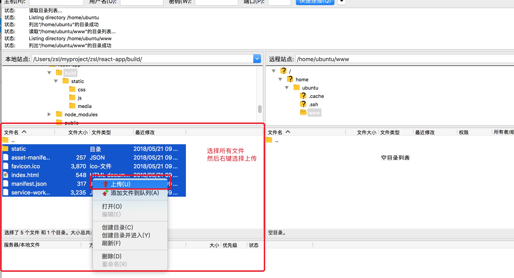
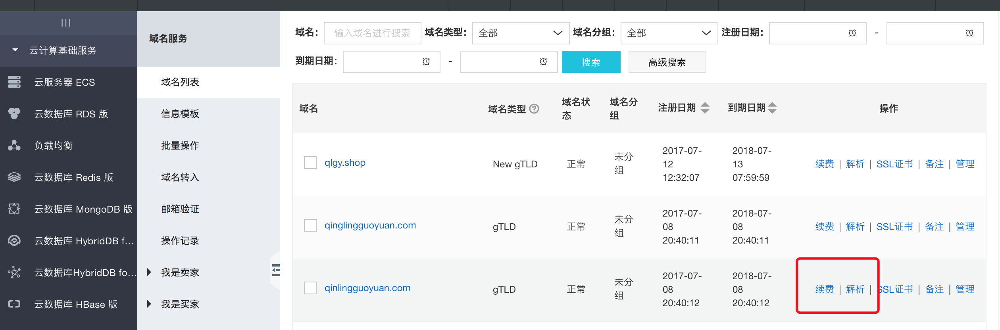

### 网站部署到服务器流程

- 连接服务器

```java
$ ssh 用户名@公网ip地址
```
> 例如

```java
$ ssh ubuntu@118.89.238.175
接下来输入 yes（只有第一次需要输入）
然后再输入密码
```

> 提示

```java
阿里云通常是$ ssh root@118.89.238.175
连接成功后继续下一步
```

- 安装 Nginx 到服务器

```java
$ sudo apt-get install nginx
```

- 创建网站存放目录

先输入``pwd`` 看看当前所在的路径

```java
$ pwd
(我这里返回/home/ubuntu)就是我的路径
```

新建一个``www``的文件夹

```java
$ sudo mkdir -p www
```

赋予``www``目录权限

```java
$ sudo chown -R www-data:www-data /home/ubuntu/www
$ sudo chmod -R g+rw /home/ubuntu/www
$ sudo chmod 777 /home/ubuntu/www
```

- 把网站文件通过 FTP 工具``FileZilla`` 上传到服务器





- 配置 Nginx 

```java
编辑nginx 的默认配置文件
$ sudo vi /etc/nginx/sites-available/default
```
> - 按上下键浏览
> - 按下``i``进入编辑模式，左下角提示``--INSERT--``
> - 退出并保存先按``:``然后按``qw``
> - 退出不保存先按``:``然后按``q``

替换 root 后面的```/var/www/html```为 ```/home/ubuntu/www```，然后输入``:qw``保存退出


- 检查 Nginx 配置是否ok,出现下图表示ok

```java
$ sudo nginx -t
```


- 重启 Nginx 

```java
$ sudo service nginx restart
```

- 浏览器输入云服务器外网ip查看网站是否正确显示


### 域名配置

- 复制服务器公网ip

```java
我的公网ip是 118.89.238.175
```

- 进入阿里云后台，找到【域名与网站】，然后点击域名中对应域名后面的【解析】



- 添加解析

> 先添加【主机记录】为``@`` 和``www`` 前缀的


> 所有我需要的``@`` ``www`` ``guan`` ``douban`` 全部添加完后的样子


- 修改 Nginx 配置文件

```java
$ sudo vi /etc/nginx/sites-available/default

然后修改 server_name -  为  server_name qinlingguoyuan.com www.qinlingguoyuan.com

最后输入 :wq 保存
```


- 检查 Nginx 配置是否ok,出现下图表示ok

```java
$ sudo nginx -t
```


- 重启 Nginx 

```java
$ sudo service nginx restart
```

- 在浏览器输入域名试试看


### 配置豆瓣代理

- 修改nginx 配置

```java
sudo vi /etc/nginx/sites-available/default
```
复制下面的配置插入到``location/{try_files $uri $uri/ =404;}``之后

```java
location /theaters {
     proxy_pass https://api.douban.com/v2/movie/in_theaters;
     proxy_redirect     off;
     proxy_set_header   Referer          "https://www.douban.com";  
 }
    
location /comingSoon {
     proxy_pass https://api.douban.com/v2/movie/coming_soon;
     proxy_redirect     off;
     proxy_set_header   Referer          "https://www.douban.com";  
 }

location /top250 {
     proxy_pass https://api.douban.com/v2/movie/top250;
     proxy_redirect     off;
     proxy_set_header   Referer          "https://www.douban.com";  
 }

 location /search {
     proxy_pass https://api.douban.com/v2/movie/search;
     proxy_redirect     off;
     proxy_set_header   Referer          "https://www.douban.com";  
 }
    
 location /movie_subject{
     proxy_pass https://api.douban.com/v2/movie/subject/;
     proxy_redirect     off;
     proxy_set_header   Referer          "https://www.douban.com";  
 }      
```


插入完毕之后 ``:qw``保存退出

- 检查 Nginx 配置是否ok,出现下图表示ok

```java
$ sudo nginx -t
```


- 重启 Nginx 

```java
$ sudo service nginx restart
```

- 访问一下


### 多网站部署

一个服务器上部署多个网站的需求

- 复制之前的站点到react

```java
$ sudo cp -ri www react
//赋予权限
$ sudo chown -R www-data:www-data /home/ubuntu/react
$ sudo chmod -R g+rw /home/ubuntu/react
$ sudo chmod 777 /home/ubuntu/react
//删除之前的站点
$ sudo rm -r www
```

- 复制 Nginx 配置文件

```java
$ sudo cp /etc/nginx/sites-available/default /etc/nginx/sites-available/react
```

- 修改react配置文件``root /home/ubuntu/www ``为``root /home/ubuntu/react``

```java
$ sudo vi /etc/nginx/sites-available/react
```

修改完毕之后 ``:qw``保存退出

- 建立软链接

```java
$ sudo ln -s /etc/nginx/sites-available/react /etc/nginx/sites-enabled/
```

- 删除 Nginx 默认配置

```java
$ sudo rm /etc/nginx/sites-available/default
```

- 删除默认 Nginx 软链接

```java
$ sudo rm -rf /etc/nginx/sites-enabled/default
```

- 测试重启 Nginx

```java
//测试nginx 配置
$ sudo nginx -t
//重启nginx
$ sudo service nginx restart
```

-  测试访问


- 创建第二个站点

```java
$ sudo mkdir vue
//赋予权限
$ sudo chown -R www-data:www-data /home/ubuntu/vue
$ sudo chmod -R g+rw /home/ubuntu/vue
$ sudo chmod 777 /home/ubuntu/vue
```

- 通过 FTP 上传 vue 网站到服务器


- 配置 Nginx 

```java
$ sudo cp /etc/nginx/sites-available/react /etc/nginx/sites-available/vue
```

- 修改配置文件

> - root /home/ubuntu/react 修改为 root /home/ubuntu/vue
> - server_name loveguan.com www.loveguan.cn; 修改为 server_name vue.loveguan.cn; 
> - 要记得去做 vue.loveguan.cn 的域名解析

```java
$ sudo vi /etc/nginx/sites-available/vue
```


修改完毕之后 ``:qw``保存退出

- 做``vue.loveguan.cn``域名解析


- 建立软链接

```java
$ sudo ln -s /etc/nginx/sites-available/vue /etc/nginx/sites-enabled/
```

- 测试重启 Nginx

```java
//测试nginx 配置
$ sudo nginx -t
//重启nginx
$ sudo service nginx restart
```

-  测试访问


### Nginx 配置全站 https（待补充）
